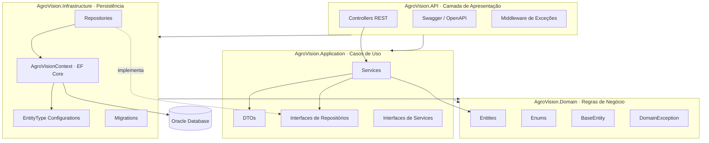
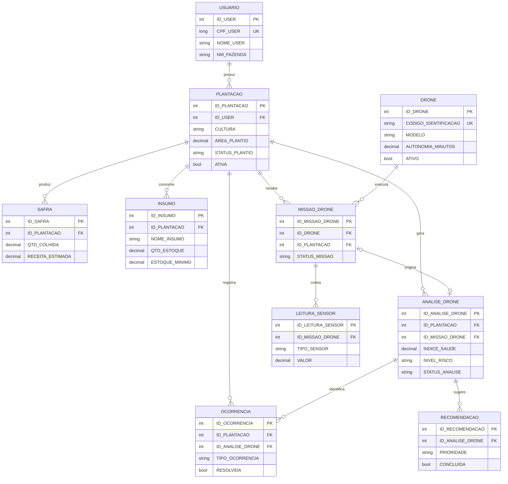

# 🌾 AgroVision

> API REST para análise e diagnóstico de plantações utilizando drones, sensores e inteligência agronômica.

AgroVision é uma plataforma de **agricultura de precisão** que centraliza dados coletados por drones e sensores de campo para gerar diagnósticos automáticos da saúde das lavouras, recomendações agronômicas e controle de insumos, safras e ocorrências — tudo a partir de uma única API.

---

## 📑 Sumário

- [Problema e Solução](#-problema-e-solução)
- [Viabilidade e Inovação](#-viabilidade-e-inovação)
- [Arquitetura](#-arquitetura)
- [Modelo de Dados (Diagrama ER)](#-modelo-de-dados-diagrama-er)
- [Tecnologias](#-tecnologias)
- [Estrutura do Projeto](#-estrutura-do-projeto)
- [Pré-requisitos](#-pré-requisitos)
- [Configuração e Execução](#-configuração-e-execução)
- [Migrations](#-migrations)
- [Endpoints da API](#-endpoints-da-api)
- [Exemplos de Testes](#-exemplos-de-testes)
- [Como Testar](#-como-testar)
- [Boas Práticas Adotadas](#-boas-práticas-adotadas)
- [Vídeos](#-vídeos)
- [Equipe](#-equipe)

---

## 🎯 Problema e Solução

O produtor rural tradicional acompanha a lavoura de forma manual e reativa: percorre talhões a pé, identifica pragas e falhas tarde demais e decide a aplicação de insumos com base em experiência, não em dados. Isso gera **perda de produtividade, desperdício de defensivos e impacto ambiental**.

O **AgroVision** resolve isso ao transformar voos de drone e leituras de sensores em informação acionável:

1. O drone executa uma **missão** sobre a plantação, coletando **leituras de sensores** (umidade do solo, temperatura, NDVI, pH).
2. A partir desses dados é registrada uma **análise**, que **calcula automaticamente** o nível de risco e o status da lavoura.
3. A análise gera **ocorrências** (pragas, doenças, baixa umidade etc.) e **recomendações agronômicas** priorizadas.
4. O produtor acompanha **insumos** (com alerta de estoque baixo) e **safras** (produtividade e perdas) por plantação.

## 💡 Viabilidade e Inovação

- **Viabilidade técnica:** usa apenas hardware já disponível no agronegócio (drones de pulverização/mapeamento e sensores IoT) e expõe os dados por uma API REST padronizada, fácil de integrar a apps web/mobile ou dashboards.
- **Inovação:** o diagnóstico não é manual. A entidade `AnaliseDrone` contém uma **regra de negócio que classifica a saúde da lavoura** (BAIXO → CRÍTICO) combinando índice de saúde, NDVI, umidade do solo, presença de pragas e área afetada, devolvendo já uma recomendação textual. Isso aproxima a solução de um **sistema de apoio à decisão**, não apenas um CRUD.
- **Escalabilidade:** a arquitetura em camadas (DDD) permite trocar o banco, adicionar autenticação ou integrar modelos de IA sem reescrever o domínio.

---

## 🏗 Arquitetura

O projeto segue uma arquitetura em camadas inspirada em **DDD (Domain-Driven Design)**, com dependências apontando sempre para o domínio (Dependency Inversion).



**Princípios aplicados**

| Camada | Responsabilidade | Depende de |
|--------|------------------|------------|
| **Domain** | Entidades, regras de negócio, validações e enums. Não depende de ninguém. | — |
| **Application** | Orquestra casos de uso, define contratos (interfaces) e DTOs. | Domain |
| **Infrastructure** | Implementa repositórios e persistência com EF Core + Oracle. | Domain, Application |
| **API** | Expõe endpoints REST, Swagger e tratamento global de erros. | Application, Infrastructure |

> As entidades de domínio são **ricas e encapsuladas**: propriedades têm `private set`, a construção passa por validação e o estado só muda por métodos de negócio (ex.: `IniciarMissao()`, `RegistrarAplicacao()`, `CalcularDiagnostico()`).

---

## 🗃 Modelo de Dados (Diagrama ER)

A persistência é **relacional (Oracle)** e contém múltiplos relacionamentos **1:N** e um relacionamento **1:1 opcional** (Missão ↔ Análise).



**Relacionamentos implementados**

| Relacionamento | Cardinalidade | Observação |
|----------------|---------------|------------|
| Usuário → Plantação | 1:N | `Restrict` (não apaga usuário com plantações) |
| Plantação → Safra / Insumo / Missão / Análise / Ocorrência | 1:N | `Cascade` |
| Drone → Missão | 1:N | `Restrict` |
| Missão → Leitura de Sensor | 1:N | `Cascade` |
| Missão → Análise | 1:0..1 | opcional (`SetNull`) |
| Análise → Ocorrência | 1:N | opcional (`SetNull`) |
| Análise → Recomendação | 1:N | `Cascade` |

Existe ainda a tabela `TB_LOG_ERRO_GS` (entidade `LogErro`), independente, preparada para registro de erros de procedures no padrão Oracle/FIAP.

---

## 🛠 Tecnologias

- **.NET 10** / ASP.NET Core (Web API)
- **Entity Framework Core 10** (Code First + Migrations)
- **Oracle.EntityFrameworkCore** (provider Oracle)
- **Swagger / Swashbuckle** (documentação OpenAPI)
- Arquitetura **DDD em camadas**

---

## 📂 Estrutura do Projeto

```
AgroVision/
├── AgroVision.sln
├── AgroVision.Domain/            # Entidades, enums, regras de negócio
│   ├── Common/BaseEntity.cs
│   ├── Entities/                 # Usuario, Plantacao, Drone, AnaliseDrone...
│   ├── Enums/                    # NivelRisco, StatusPlantio, TipoSensor...
│   └── Exceptions/DomainException.cs
├── AgroVision.Application/        # Casos de uso e contratos
│   ├── DTOs/                      # Create / Update / Response por entidade
│   ├── Interfaces/                # IRepositories e IServices
│   ├── Services/                  # Regras de aplicação
│   └── DependencyInjection.cs
├── AgroVision.Infrastructure/     # Persistência
│   └── Persistence/
│       ├── AgroVisionContext.cs
│       ├── Configurations/        # Fluent API por entidade
│       ├── Repositories/          # Implementações EF Core
│       └── Migrations/            # InitialCreate
└── AgroVision.API/                # Apresentação
    ├── Controllers/               # 10 controllers REST
    ├── Program.cs                 # Pipeline, Swagger, CORS, erros
    └── appsettings*.json
```

---

## ✅ Pré-requisitos

- [.NET SDK 10.0+](https://dotnet.microsoft.com/download)
- Acesso a um banco **Oracle** (ex.: instância FIAP `oracle.fiap.com.br:1521/ORCL`)
- (Opcional) ferramenta EF Core CLI:
  ```bash
  dotnet tool install --global dotnet-ef
  ```

---

## ⚙ Configuração e Execução

**1. Clone o repositório**
```bash
git clone https://github.com/<seu-usuario>/AgroVision.git
cd AgroVision
```

**2. Configure a string de conexão**

O arquivo `AgroVision.API/appsettings.Development.json` **não é versionado** (contém credenciais). Crie-o a partir do exemplo:

```bash
cp AgroVision.API/appsettings.Development.example.json AgroVision.API/appsettings.Development.json
```

E preencha com seu usuário/senha do Oracle:
```json
{
  "ConnectionStrings": {
    "OracleConnection": "User Id=SEU_RM;Password=SUA_SENHA;Data Source=oracle.fiap.com.br:1521/ORCL;"
  }
}
```

**3. Restaure e compile**
```bash
dotnet restore
dotnet build
```

**4. Crie as tabelas no banco (aplica a migration)**
```bash
dotnet ef database update --project AgroVision.Infrastructure --startup-project AgroVision.API
```

**5. Execute a API**
```bash
dotnet run --project AgroVision.API
```

**6. Acesse a documentação interativa (Swagger)**

A interface do Swagger é servida na **raiz** da aplicação:

```
http://localhost:5039/
```

> A porta padrão é `5039` (HTTP) — definida em `Properties/launchSettings.json`.

---

## 🔄 Migrations

O projeto usa **EF Core Code First**. A migration inicial (`InitialCreate`) já está incluída e cria todas as 11 tabelas com chaves, índices únicos e foreign keys.

| Comando | Descrição |
|---------|-----------|
| `dotnet ef migrations add <Nome> --project AgroVision.Infrastructure --startup-project AgroVision.API` | Cria nova migration |
| `dotnet ef database update --project AgroVision.Infrastructure --startup-project AgroVision.API` | Aplica as migrations ao banco |
| `dotnet ef migrations script --idempotent ...` | Gera script SQL idempotente |
| `dotnet ef migrations list ...` | Lista migrations |

> O `DbContext` é descoberto automaticamente; as configurações são aplicadas via `ApplyConfigurationsFromAssembly`.

---

## 🌐 Endpoints da API

Todos os recursos seguem o padrão REST sob `/api/[recurso]`. Resumo dos principais:

### Usuários `/api/usuarios`
| Método | Rota | Descrição |
|--------|------|-----------|
| GET | `/` | Lista usuários |
| GET | `/{id}` | Busca por id |
| POST | `/` | Cria usuário (CPF único) |
| PUT | `/{id}` | Atualiza |
| DELETE | `/{id}` | Remove |

### Plantações `/api/plantacoes`
| Método | Rota | Descrição |
|--------|------|-----------|
| GET | `/` · `/{id}` · `/ativas` · `/usuario/{usuarioId}` | Consultas |
| POST | `/` | Cria plantação |
| PUT | `/{id}` | Atualiza |
| PATCH | `/{id}/encerrar` · `/{id}/reativar` | Muda status |
| DELETE | `/{id}` | Remove |

### Drones `/api/drones`
| Método | Rota | Descrição |
|--------|------|-----------|
| GET | `/` · `/{id}` · `/ativos` | Consultas |
| POST | `/` | Cria drone |
| POST | `/{id}/verificar-autonomia` | Valida autonomia para uma missão |
| PATCH | `/{id}/ativar` · `/{id}/desativar` | Muda status |
| PUT / DELETE | `/{id}` | Atualiza / remove |

### Missões de Drone `/api/missoesdrone`
| Método | Rota | Descrição |
|--------|------|-----------|
| GET | `/` · `/{id}` · `/drone/{id}` · `/plantacao/{id}` · `/em-andamento` | Consultas |
| POST | `/` | Agenda missão (valida drone ativo + plantação) |
| PATCH | `/{id}/iniciar` · `/{id}/finalizar` · `/{id}/cancelar` | Ciclo de vida |
| DELETE | `/{id}` | Remove |

### Leituras de Sensor `/api/leiturassensor`
GET (`/`, `/{id}`, `/missao/{id}`, `/fora-do-padrao`), POST, DELETE.

### Análises de Drone `/api/analisesdrone`
GET (`/`, `/{id}`, `/plantacao/{id}`, `/plantacao/{id}/ultima`, `/criticas`), POST, PUT, DELETE.
> Ao criar/atualizar, o **diagnóstico (nível de risco + recomendação) é calculado automaticamente**.

### Ocorrências `/api/ocorrenciasplantacao`
GET (`/`, `/{id}`, `/plantacao/{id}`, `/pendentes`, `/criticas`), POST, PATCH (`/resolver`, `/reabrir`), DELETE.

### Recomendações Agronômicas `/api/recomendacoesagronomicas`
GET (`/`, `/{id}`, `/analise/{id}`, `/pendentes`, `/urgentes`), POST, PATCH (`/concluir`, `/reabrir`), DELETE.

### Insumos `/api/insumos`
GET (`/`, `/{id}`, `/plantacao/{id}`, `/estoque-baixo`), POST, PUT, PATCH (`/registrar-aplicacao`, `/repor-estoque`), DELETE.

### Safras `/api/safras`
GET (`/`, `/{id}`, `/plantacao/{id}`), POST, PUT, DELETE.

---

## 🧪 Exemplos de Testes

> O arquivo [`AgroVision.API/AgroVision.http`](AgroVision.API/AgroVision.http) já contém requisições prontas para rodar no VS / Rider / extensão REST Client.

### 1) Criar um usuário
```http
POST http://localhost:5039/api/usuarios
Content-Type: application/json

{
  "cpf": 12345678901,
  "nome": "João da Silva",
  "senha": "senha123",
  "nomeFazenda": "Fazenda Boa Vista"
}
```
**Resposta `201 Created`**
```json
{
  "id": 1,
  "cpf": 12345678901,
  "nome": "João da Silva",
  "nomeFazenda": "Fazenda Boa Vista",
  "totalPlantacoes": 0
}
```

### 2) Criar uma plantação
```http
POST http://localhost:5039/api/plantacoes
Content-Type: application/json

{
  "usuarioId": 1,
  "tipoPlantio": "Sequeiro",
  "cultura": "Soja",
  "areaPlantio": 120.5,
  "produtividadeEstimada": 3.2,
  "dataPlantio": "2026-01-15T00:00:00",
  "localPlantio": "Talhão Norte",
  "statusPlantio": "PLANTADO"
}
```

### 3) Registrar uma análise (diagnóstico automático)
```http
POST http://localhost:5039/api/analisesdrone
Content-Type: application/json

{
  "plantacaoId": 1,
  "missaoDroneId": null,
  "dataAnalise": "2026-02-01T10:00:00",
  "indiceSaude": 85,
  "umidadeSolo": 45,
  "temperaturaMedia": 27.5,
  "indiceVegetacaoNdvi": 0.72,
  "areaAfetadaPercentual": 5,
  "pragasDetectadas": false,
  "observacaoImagem": "Vegetação homogênea, sem falhas visíveis."
}
```
**Resposta** — note os campos `nivelRisco` e `recomendacao` preenchidos pela regra de negócio:
```json
{
  "id": 1,
  "plantacaoId": 1,
  "indiceSaude": 85,
  "nivelRisco": "BAIXO",
  "statusAnalise": "SAUDAVEL",
  "recomendacao": "Plantação saudável. Manter monitoramento periódico."
}
```

### 4) Exemplo de erro de validação (`400 Bad Request`)
Criar usuário com CPF já existente devolve:
```json
{
  "status": 400,
  "erro": "Já existe um usuário cadastrado com este CPF."
}
```

---

## 🔍 Como Testar

Há três formas de validar a API:

1. **Swagger UI** — abra `http://localhost:5039/` após `dotnet run`. Todos os endpoints podem ser executados pelo navegador, com schemas e exemplos.
2. **Arquivo `.http`** — abra `AgroVision.API/AgroVision.http` no Visual Studio / Rider / VS Code (extensão *REST Client*) e dispare as requisições na ordem (usuário → plantação → análise).
3. **cURL / Postman** — use as URLs e payloads dos exemplos acima.

**Roteiro de teste ponta a ponta sugerido:**
`POST usuário` → `POST plantação` (usando o id do usuário) → `POST drone` → `POST missão` → `PATCH missão/iniciar` → `POST leitura de sensor` → `POST análise` → verificar `GET /api/recomendacoesagronomicas/urgentes` e `GET /api/ocorrenciasplantacao/pendentes`.

> O build foi validado com `dotnet build` (**0 erros / 0 warnings**) e o modelo EF foi conferido com `dotnet ef migrations has-pending-model-changes` (sem divergências entre o modelo e a migration).

---

## ⭐ Boas Práticas Adotadas

- **Separação em camadas (DDD)** com inversão de dependência via interfaces.
- **Entidades ricas**: validação no construtor, `private set`, comportamento encapsulado em métodos de negócio.
- **DTOs dedicados** para entrada (`Create`/`Update`) e saída (`Response`) — o domínio nunca é exposto diretamente.
- **Tratamento global de exceções**: `DomainException` → `400 Bad Request`; demais erros → `500` com mensagem padronizada (JSON).
- **Fluent API** isolada em `Configurations`, mantendo o `DbContext` enxuto.
- **Migrations** versionadas (Code First).
- **Conversão de enums para string** no banco (legibilidade) e **índices únicos** (CPF, código do drone).
- **Segredos fora do versionamento**: `appsettings.Development.json` no `.gitignore`, com um `*.example.json` de referência.

---

## 🎬 Vídeos

- 🎥 **Demonstração da solução (máx. 8 min):** _adicionar link_
- 🎤 **Pitch (máx. 3 min):** _adicionar link_

---

## 👥 Equipe

| Nome | RM | GitHub |
|------|----|--------|
| _Integrante 1_ | _RMxxxxxx_ | _@usuario_ |
| _Integrante 2_ | _RMxxxxxx_ | _@usuario_ |
| _Integrante 3_ | _RMxxxxxx_ | _@usuario_ |

---

<p align="center">Desenvolvido como entrega de Portal — FIAP · Global Solution</p>
